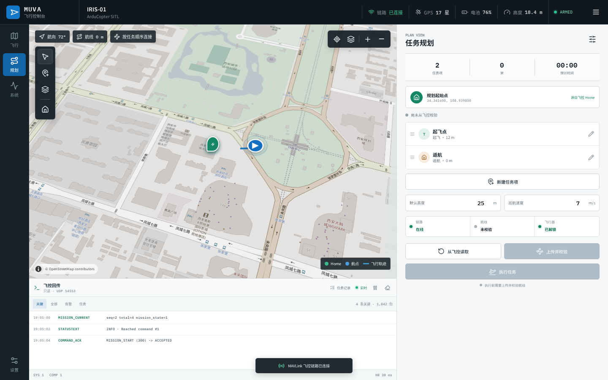

# MUVA Gazebo MAVLink Ground Station

MUVA 是一个面向 ArduCopter SITL 的本地 Web 地面站，提供飞行遥测、航线规划、航点编辑、任务上传校验、任务执行和飞控回传监控。



## 功能

- QGC 风格规划视图：地图连续选点、按点击顺序连接航线、航点拖动和列表排序
- 航点参数编辑：任务类型、坐标、高度、悬停时间、到达半径和航向
- 任务起始点与飞控 Home 点区分
- 任务上传、读取、校验和执行条件提示
- 飞行控制：模式切换、解锁、起飞、悬停、返航、降落和刹停
- 姿态、高度、速度、电池、GPS 和链路遥测
- 全局飞控回传控制台：只显示命令确认、模式/解锁变化、任务进度、到达航点和告警
- 桌面、平板和移动端响应式布局

## MAVLink 端口

项目使用两条独立的 MAVLink UDP 链路，避免只读监控抢占控制数据：

- `14552`：MUVA 控制网关，提供 HTTP API 和 `/ws/telemetry`
- `14553`：只读飞控回传监控，提供 `/api/monitor` 和 `/ws/monitor`

监控链路不会发送解锁、模式或任务控制命令。

## 启动

需要预先安装 Gazebo、ArduPilot SITL、Python 3 和 Node.js。项目不会把 ArduPilot、Gazebo 构建目录、Python 虚拟环境或 `node_modules` 提交到仓库。启动脚本默认查找仓库同级的 `ardupilot/` 和 `ardupilot_gazebo/`，也可以通过 `MUVA_ARDUPILOT_DIR`、`MUVA_ARDUPILOT_GAZEBO_DIR` 指定路径。

```bash
# 启动 Gazebo 世界（可选）
./start_iris_gazebo.sh

# 启动 ArduCopter SITL，同时输出到 14552 和 14553
./start_iris_sitl.sh

# 启动 MAVLink 网关和 Web GCS
./start_web_gcs.sh
```

打开 <http://localhost:5173>。纯界面演示模式为 <http://localhost:5173/?demo=1>，不会向飞控发送命令。

网关 API 文档位于 <http://localhost:8000/docs>。

如需独立终端监控，请为 SITL 增加第三路 `--out=127.0.0.1:14554`，然后运行：

```bash
./start_mavlink_monitor.sh --port 14554
```

## 开发与测试

```bash
cd web-gcs
npm install
npm run build
npm run test:e2e
```

后端依赖和测试：

```bash
cd mavlink-gateway
python3 -m pip install -r requirements.txt
python3 -m pip install -r requirements-dev.txt
python3 -m pytest -q
```

完整 SITL 飞行冒烟测试是主动控制仿真飞行器的测试，仅在本地 SITL 环境运行：

```bash
MUVA_RUN_SITL_E2E=1 python3 mavlink-gateway/tests/sitl_e2e.py
```

## 目录

```text
web-gcs/             React + Vite 前端
mavlink-gateway/     FastAPI 控制网关和只读监控接收器
start_iris_sitl.sh   ArduCopter SITL 双端口启动脚本
start_web_gcs.sh     网关与前端联合启动脚本
WEB_GCS.md           地面站启动和联调说明
```
